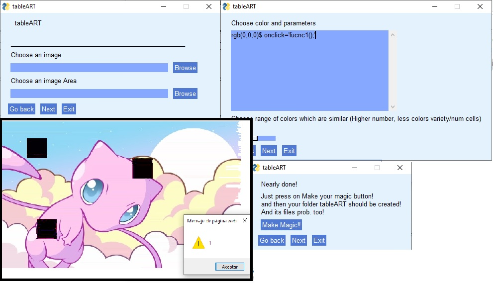

# tableArt

Thanks to PySimpleGui creator.. his library is too awesome.

Ok.. This little monsta', with the help of python, takes 2 images (equal size pls), one text which joins each RGB color to JS function and one number that indicates how far 2 colors are similar, from the user in a fancy way.
Done this, he calls to his more big brotha', who knows nothing but java, so still handed to run 4 threads inefficiently.

Finally output comes with 3 heads on her neck.. first head, called index.html aka tooManyCells, the second one is Normalize.css, seems as pretty as not useful and the last one is the script.js you just wrote waay before.

Sorry for that, have fun!, 
Everybody love screens,

PD: Use firefox to run index.html, it's somehow faster.

